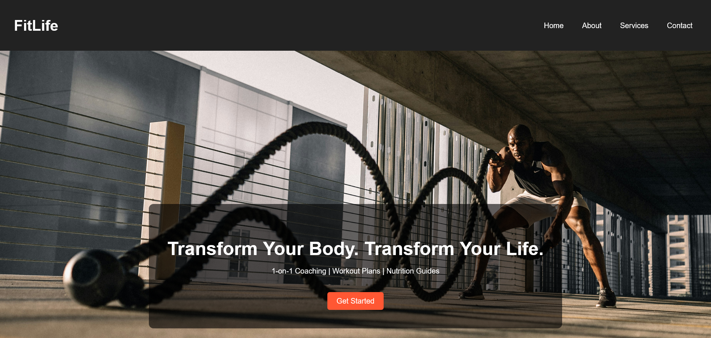
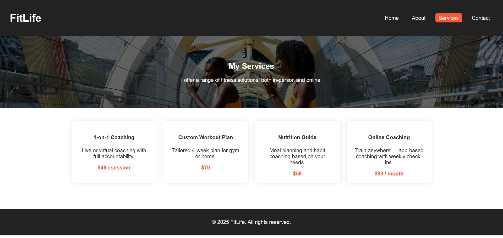

# 💪 FitLife – Personal Trainer Website

A responsive, modern website for a personal trainer built with HTML, CSS, and JavaScript. This project includes parallax backgrounds, animated sections, service cards, and contact form — perfect for showcasing fitness coaching services online.

## 🌐 Live Demo

➡️ [Visit the Live Website]([https://github.com/vasilkovskis/personal-trainer-site])

---

## 🧰 Features

- 🔥 Full-screen hero with parallax effect
- 🎯 About page with icons, tiles, and skill sections
- 💼 Services page with pricing cards
- ❓ Interactive FAQ accordion
- 💬 Contact form layout
- 📱 Mobile-friendly and responsive design
- ✨ Smooth scroll + AOS scroll animations

---

## 📷 Screenshots

---

## 📁 Folder Structure
personal-trainer-site/
├── index.html
├── about.html
├── services.html
├── contact.html
├── style.css
├── script.js
├── images/
└── README.md

## 👤 Author

**Stanislav Vasilkovski**  
Freelancer  
[GitHub Profile](https://github.com/vasilkovskis)  
[Email](mailto:cvasilkovski@gmail.com)

---

## 🪪 License

This project is open-source for educational and freelance portfolio use. For commercial reuse, please contact the author.
